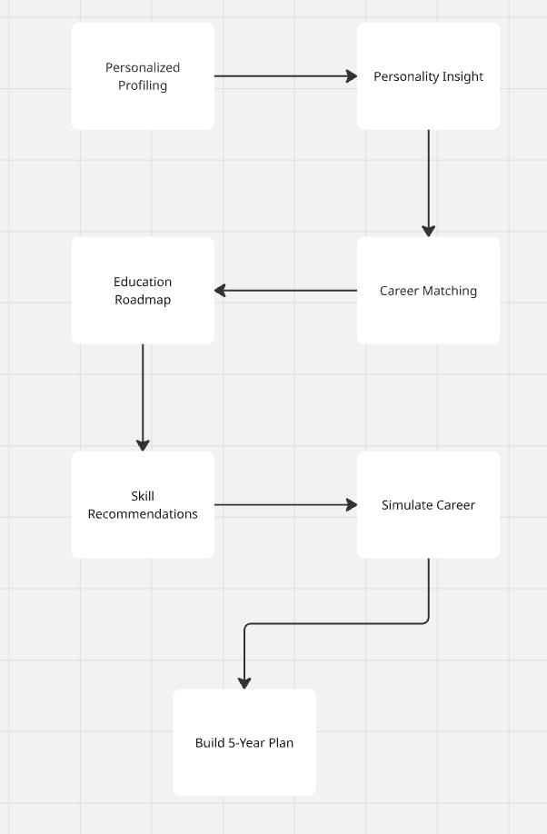

# 🎓 EduPath Agent – Personalized AI Career Planner




**EduPath Agent** is an AI-powered career advisor built with the [Mastra](https://mastra.ai) framework for the Nosana Builders Challenge. It helps students explore career paths, align with their strengths, and design a personalized 5-year development roadmap — all through an intelligent, conversational agent.
- 📹 Demo Video X: (https://x.com/AydenCryptoWRLD/status/1942437973737312272)
---

## ✨ Key Features

- **🎯 Personalized Profiling**  
  Gathers academic background, interests, and preferences.

- **🧠 Personality Insight**  
  Analyzes personality types (e.g., INTJ, ENFP) and suggests suitable careers.

- **💼 Career Matching**  
  Recommends logical career paths based on user profile.

- **🎓 Education Roadmap**  
  Suggests degrees, certifications, or learning tracks.

- **🛠️ Skill Recommendations**  
  Maps out technical skills for the next 3–5 years.

- **📆 5-Year Plan Builder**  
  Produces a structured, achievable development roadmap.

- **📽️ Career Simulation**  
  Simulates a realistic day-in-the-life of selected career paths.

---

## 🔍 Feature Details

### 🎯 Personalized Profiling

EduPath begins by understanding the user on a personal level. It collects information about:

- Academic strengths  
- Hobbies and interests  
- Preferred work style (independent vs collaborative)  
- Socioeconomic background

This foundation ensures all advice is tailored, grounded, and personalized.

### 🧠 Personality Insight

The agent uses conversational context and common personality theory (like MBTI) to identify:

- Your personality type (e.g., INTJ, ENFP)  
- Your working style and preferences  
- Best communication and motivation approach for your type

### 💼 Career Matching

With your profile and personality mapped, EduPath recommends career options by:

- Matching interests with market-relevant careers  
- Filtering based on personality and workstyle  
- Prioritizing long-term fit and fulfillment

### 🎓 Education Roadmap

Each career suggestion comes with a clear education plan:

- Recommended university degrees  
- Certification programs (Google, AWS, Coursera, etc.)  
- Online learning or bootcamp alternatives  
- Budget-conscious paths for all income levels

### 🛠 Skill Recommendations

EduPath builds a learning path over 3–5 years including:

- Programming languages, design tools, or data skills  
- Project-based learning and real-world applications  
- Communication and collaboration skills  
- Learning sources (MOOCs, GitHub, YouTube, etc.)

### 📽 Career Simulation

To help visualize your future, EduPath simulates:

- A typical workday in your selected career  
- Example tasks, tools, and meetings  
- Work style (remote, hybrid, on-site)  
- Lifestyle implications

### 📆 5-Year Plan Builder

You'll receive a full roadmap with:

- Education goals  
- Skill progression timeline  
- Suggested internships or freelance gigs  
- Open-source contribution opportunities  
- Annual reassessment milestones

---

## 🧠 How It Works

The agent runs a modular pipeline:

1. `collectUserProfile` – Gathers personal data  
2. `analyzePersonality` – Infers MBTI/work style  
3. `matchCareer` – Finds compatible roles  
4. `recommendEducationPath` – Suggests education options  
5. `suggestSkillRoadmap` – Creates skills plan  
6. `simulateCareer` – Shows typical workday  
7. `build5YearPlan` – Generates complete roadmap

---

## 💻 Run It Locally
```bash
git clone https://github.com/aydenchain/agent-challenge
```
### 🔧 Prerequisites

- Node.js v18+
- [pnpm](https://pnpm.io/installation)
- [Ollama](https://ollama.com/) (optional for local LLM)

### 🚀 Start Development Server

```bash
pnpm install
pnpm run dev
```
---
Visit http://localhost:8080 in your browser.
---
## ⚙️ Environment Setup
```bash
cp .env.example .env
```
### For Ollama 
API_BASE_URL=http://localhost:11434/api (this is for local, check .env.example to Nosana or cloud deployments with GPU support)
MODEL_NAME_AT_ENDPOINT=qwen2.5:1.5b

Make sure Ollama is running in the background.

---
## 🐳 Docker Support
### Build Image
```bash
docker build -t username/agent-challenge:dev .
docker login
```
### Run Container
```bash
docker run -p 8080:8080 --env-file .env username/agent-challenge:dev
```
### Push to Docker Hub (Optional)
```bash
docker tag agent-challenge username/agent-challenge:dev
docker push username/agent-challenge:dev
```
##  Sample Use Case
### User Input:
Hi! I'm a high school science student who enjoys math, computers, and coding.
I prefer working alone and dislike high-social interaction jobs.
In my free time, I play games and experiment with AI tools like ChatGPT.
My family comes from a lower-middle income background.
I want to know what career suits me and how to prepare for it over the next 5 years.
✅ The agent activates all 7 tools, generates a custom personality type, career matches like Data Scientist or AI Engineer, and even shows a realistic daily schedule and full 5-year plan.
### EduPath Output:
Hello! Welcome to EduPath. Let's start by understanding your interests and preferences, as well as your background.

Personal Profile
Based on your responses, you are currently a high school science student who enjoys math, computers, and coding. You prefer working alone and dislike high-social interaction jobs. In your free time, you play games and experiment with AI tools like ChatGPT.

Personality Analysis
Your interests in mathematics, computer science, and programming suggest an aptitude for logical thinking, problem-solving, and technical skills. Your preference for working independently indicates a strong work ethic and self-motivation. However, the interest in coding also implies a curiosity and creativity that can be beneficial in many fields.

Career Matching
Given your interests in math, computers, and programming, you might find careers such as Data Scientist or AI Engineer highly suitable. These roles involve using mathematical models to analyze data, developing algorithms for machine learning, and creating artificial intelligence systems.

Educational Path Recommendation
To align with these career paths, it would be beneficial to focus on subjects like computer science, mathematics, and programming during your high school years. Additionally, consider taking courses or workshops in coding languages (e.g., Python, JavaScript) and data analysis tools (e.g., R, SQL).

Skill Roadmap for the Next 5 Years
Mathematics: Strengthen your understanding of algebra, calculus, and statistics.
Programming Languages: Learn at least one programming language like Python or Java.
Data Analysis Tools: Familiarize yourself with tools such as R, SQL, and data visualization libraries (e.g., Matplotlib, Seaborn).
Computer Science Fundamentals: Understand algorithms, computer architecture, and software development methodologies.
Simulating Your Career
With a strong foundation in mathematics, programming, and data analysis, you could start your career in Data Analysis or AI Engineering. Here’s how it might look over the next 5 years:

Year 1: Focus on developing foundational skills in math and computer science.
Year 2: Dive deeper into programming languages and learn more about algorithmic thinking.
Year 3: Start applying your knowledge to projects or small-scale data analysis.
Year 4: Develop a strong understanding of machine learning concepts and start building simple AI models.
Year 5: Continue honing skills, possibly taking on larger projects that integrate multiple disciplines.
Action Plan
1st Year: Focus on developing foundational math and computer science skills.
2nd Year: Dive into programming languages like Python or Java to build a strong technical foundation.
3rd Year: Start applying your knowledge through small data analysis projects.
4th Year: Build a solid understanding of machine learning concepts, starting with simple models.
5th Year: Continue developing skills and explore more complex projects that integrate multiple disciplines.
This plan is designed to help you build the necessary skills for a career in Data Science or AI Engineering. Remember, persistence and continuous learning are key to success in these fields!

Would you like any further assistance or have any questions about your future plans?

## 🙌 Acknowledgements
Thanks to:

Mastra – Modular AI framework

Nosana – Decentralized hosting

Open Source Community

---

## 📦 Submission Links

- 🔗 Deployment Page Agent Nosana: ( https://dashboard.nosana.com/jobs/9jcRcJYBQjb4gxee5a8gUf1XFL4KZdKFj1gMM8oyHpWB )
- 🐳 Docker Image: (https://hub.docker.com/r/aydenchain/agent-challenge)
- 📹 Demo Video X: (https://x.com/AydenCryptoWRLD/status/1942437973737312272)
- 📹 Demo Video Youtube: (https://youtu.be/XrAqkJXZmjc)
- 💻 Source Code: (https://github.com/aydenchain/agent-challenge)


